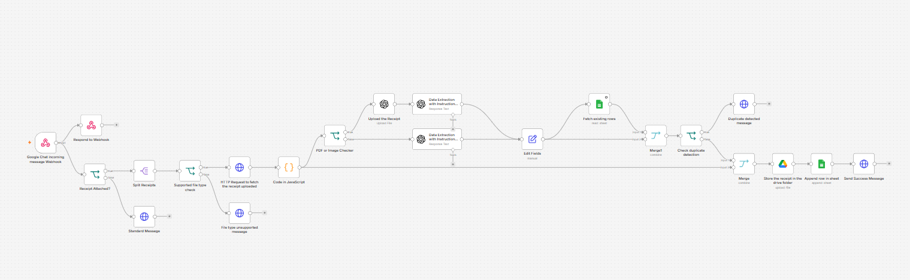

# Sai’s n8n Reimbursement Filer

An n8n workflow that lets a user submit a receipt in Google Chat. It validates the attachment, extracts reimbursement fields with OpenAI, checks for a likely duplicate in Google Sheets, stores the original receipt in Google Drive, and records the result in a reimbursement tracker.

  

## What it does

1. Receives Google Chat events through an n8n webhook.
2. Responds immediately so the Chat interaction does not time out.
3. Accepts PDF, PNG, and JPEG receipt attachments.
4. Downloads the original attachment and keeps its file bytes unchanged.
5. Uses OpenAI to extract merchant, date, amount, currency, tax, invoice number, category, description, payment method, and confidence.
6. Looks for an existing tracker row using employee email, merchant, date, and amount.
7. Stops duplicate submissions and sends a Chat notification.
8. Saves new receipts to Drive and appends the extracted data to Sheets.
9. Sends success or guidance messages back to Google Chat.

## Scope and assumptions

This is a starter automation, not a complete expense-management system. It assumes one Google Chat space, one Drive destination, and one Sheets tracker. Approval routing, accounting-system posting, tax-policy enforcement, employee directory validation, and authentication/authorization policy are outside the workflow’s current scope.

The duplicate check is heuristic: it depends on the identifying fields available in the tracker and can produce false positives or negatives. Review the matching logic before using it for financial records.

## Files

- `Sai's Reimbursements Filer.sanitized.json` — public-import workflow with private identifiers removed.
- [`docs/sais-n8n-reimbursement-filer-pitch-deck.pptx`](docs/sais-n8n-reimbursement-filer-pitch-deck.pptx) — downloadable 10-slide product case study and pitch deck.
- `README.md` — this setup and security guide.

## Setup

### 1. Import into n8n

Import the sanitized JSON into your n8n instance. Assign your own credentials to every credentialed node. Do not reuse credentials from the original owner.

### 2. Configure Google Chat

Create a Google Chat app in Google Cloud, enable the Google Chat API, and configure its interaction endpoint to the production URL generated by the imported n8n webhook node. Add the app to a test space and send a message with a receipt attachment. Update the webhook path if needed, then activate the workflow and use the production URL.

The app must be able to receive message events and access attachment/media data permitted by your Google Chat configuration. The workflow replies through the Chat API using the space name from the incoming event.

### 3. Configure Google OAuth in n8n

Create and authorize your own Google OAuth credential(s), then assign them to the Google Chat HTTP Request nodes, the attachment-download node, Google Sheets nodes, and Google Drive node as appropriate. Use the smallest practical scopes and a test account while validating.

### 4. Configure Drive

Create a destination folder in your own Google Drive. Select it in **Store the receipt in the drive folder**. Confirm the OAuth identity can create files there and that sharing settings do not expose receipts unnecessarily.

### 5. Configure Sheets

Create a tracker spreadsheet in your own Google Drive and select it in **Fetch existing rows** and **Append row in sheet**. Keep the same sheet/tab selected in both nodes. The workflow expects columns corresponding to fields such as `employee_email`, `merchant_name`, `expense_date`, `amount`, `currency`, `tax_amount`, `invoice_number`, `expense_category`, `description`, `payment_method`, `confidence`, `submitted_at`, and the stored receipt reference.

### 6. Configure OpenAI

Add your own n8n OpenAI credential to both OpenAI nodes. Review the extraction prompt, model, data-retention settings, and your organization’s policy before sending receipts. Receipts may contain personal, billing, or payment information.

## Supported files

PDF, JPEG, and PNG attachments are accepted. Other attachment types receive an unsupported-file message. Multiple attachments are split and processed individually.

## Security notes

- The sanitized export contains no API keys, OAuth client secrets, or credential values.
- Replace every placeholder such as `REPLACE_WITH_YOUR_SHEET_ID` and `REPLACE_WITH_YOUR_DRIVE_FOLDER_ID` before activation.
- Treat webhook URLs, Google resource IDs, email addresses, cached URLs, and receipt data as private deployment information.
- Use HTTPS, protect the n8n instance, restrict who can reach the webhook, and validate Google Chat event authenticity according to your deployment model.
- Never commit `.env` files, exported credentials, access tokens, or real receipts.
- If a secret was ever pasted into the original workflow or shared elsewhere, rotate it before publishing.
- Test with non-sensitive sample receipts first and inspect n8n execution logs for accidental data exposure.

## Publishing checklist

- [ ] Replace all placeholders with your own resources locally.
- [ ] Assign and test your own n8n credentials.
- [ ] Confirm the webhook uses the production URL after activation.
- [ ] Test unsupported files, multiple files, successful filing, and duplicate detection.
- [ ] Remove sample personal data and execution history before sharing.
- [ ] Review the workflow JSON once more before pushing it to GitHub.

## License

Add the license you want to use before publishing this repository.
